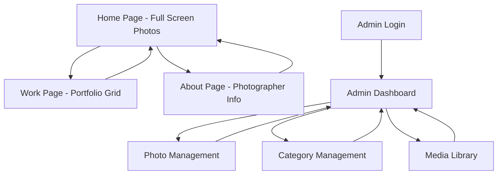

# Product Requirements Document - Lumiere Culinary Portfolio

## 1. Product Overview

Lumiere adalah platform portfolio food photography digital yang terinspirasi dari Siena Film Foundation, dirancang untuk menampilkan karya-karya fotografi kuliner dengan desain yang elegan dan modern. Platform ini memungkinkan showcase foto makanan dengan presentasi visual yang memukau dan interaksi drag-scroll yang smooth dalam satu tempat yang mudah diakses.

Target utama adalah food photographer, chef, restaurant owner, dan food enthusiast yang ingin memamerkan portofolio mereka secara profesional dengan sistem manajemen konten yang mudah digunakan melalui admin panel.

## 2. Core Features

### 2.1 User Roles

| Role | Registration Method | Core Permissions |
|------|---------------------|------------------|
| Visitor | Tidak perlu registrasi | Dapat melihat semua konten publik, portfolio film, dan informasi |
| Admin | Login dengan kredensial khusus | Dapat mengelola semua konten, menambah/edit film, awards, dan testimonials |

### 2.2 Feature Module

Platform Lumiere terdiri dari halaman-halaman utama berikut:

1. **Home**: Full-screen food photos dengan drag-scroll interaction, setiap foto memuat hampir seluruh screen dengan padding elegan
2. **Work**: Portfolio lengkap food photography dengan filter kategori makanan dan style, grid display semua foto
3. **About**: Informasi tentang photographer/chef, visi misi, team information
4. **Admin Panel**: Dashboard manajemen konten, CRUD food photos, categories, testimonials, media management

### 2.3 Page Details

| Page Name | Module Name | Feature description |
|-----------|-------------|---------------------|
| Home page | Full-Screen Photos | Display food photos dalam full-screen format dengan drag-scroll horizontal interaction. Setiap foto memuat hampir seluruh screen dengan padding elegan (top, bottom, left, right). Smooth transition antar foto. |
| Home page | Navigation Overlay | Minimalist navigation menu yang overlay di atas foto dengan elegant typography, tidak mengganggu visual utama. |
| Work page | Portfolio Grid | Display semua food photos dalam grid layout (seperti siena.film/work) dengan hover effects, category labels, dan smooth animations. |
| Work page | Filter & Search | Filter berdasarkan kategori makanan (Appetizer, Main Course, Dessert, Beverage) dan style photography. Search bar untuk mencari berdasarkan dish name atau category. |
| About page | Photographer Info | Display informasi tentang photographer/chef dengan elegant layout seperti siena.film/about, termasuk background, philosophy, dan approach. |
| About page | Team Section | Display team information dengan foto, nama, role, dan brief description dalam layout yang konsisten dengan design reference. |
| Admin Panel | Dashboard | Overview statistics (total photos, categories, views), recent uploads, quick actions untuk add new food photos. |
| Admin Panel | Photo Management | CRUD operations untuk food photos dengan form input dish name, description, category, cuisine type, photo upload, tags. |
| Admin Panel | Category Management | CRUD operations untuk food categories dengan form input category name, description, display order. |
| Admin Panel | Media Library | Upload dan manage food photos, organize dalam folders berdasarkan category, preview dan delete functionality. |
| Admin Panel | Authentication | Login form dengan email/password, session management, logout functionality. |

## 3. Core Process

**Regular User Flow:**
User mengakses homepage → melihat full-screen food photos dengan drag-scroll interaction → navigasi ke Work page untuk melihat portfolio grid lengkap → menggunakan filter untuk mencari foto berdasarkan kategori makanan atau style → kembali ke About page untuk informasi lebih lanjut tentang photographer/chef.

**Admin Flow:**
Admin login ke admin panel → akses dashboard untuk overview → manage food photo content (add/edit/delete) → manage categories dan tags → upload media ke library → logout setelah selesai.

## 4. User Interface Design

### 4.1 Design Style

- **Primary Colors**: Deep black (#000000) dan warm white (#FAFAFA) untuk kontras yang elegan
- **Secondary Colors**: Gold accent (#D4AF37) untuk highlights dan awards
- **Button Style**: Minimalist dengan rounded corners, hover effects yang subtle
- **Font**: Modern sans-serif seperti Inter atau Helvetica untuk readability
- **Layout Style**: Grid-based layout dengan white space yang generous, card-based untuk film showcase
- **Icons**: Minimalist line icons, film-related iconography untuk categories

### 4.2 Page Design Overview

| Page Name | Module Name | UI Elements |
|-----------|-------------|-------------|
| Home page | Full-Screen Photos | Full-screen food photos dengan aspect ratio yang mempertahankan kualitas, padding elegan di semua sisi (32-48px), drag-scroll horizontal dengan smooth momentum, minimalist overlay navigation |
| Home page | Navigation Overlay | Typography putih dengan font weight light, positioning fixed di top dengan backdrop blur subtle, hamburger menu atau minimal text links, tidak mengganggu visual foto |
| Work page | Portfolio Grid | Grid layout seperti siena.film/work dengan aspect ratio konsisten, hover effects dengan scale dan overlay info, filter buttons dengan active state, smooth transitions dan animations |
| About page | Photographer Info | Layout seperti siena.film/about dengan typography hierarchy yang strong, background pattern atau texture subtle, section spacing yang breathable, elegant text presentation |
| About page | Team Section | Card layout dengan foto professional, nama dengan font weight medium, role description, background dengan subtle shadow atau border, konsisten dengan design reference |

### 4.3 Responsiveness

Platform ini adalah desktop-first dengan mobile-adaptive design. Optimasi touch interaction untuk mobile devices, dengan navigation yang collapse menjadi hamburger menu pada screen kecil. Grid layout akan menyesuaikan dari 4 kolom (desktop) menjadi 2 kolom (tablet) dan 1 kolom (mobile).