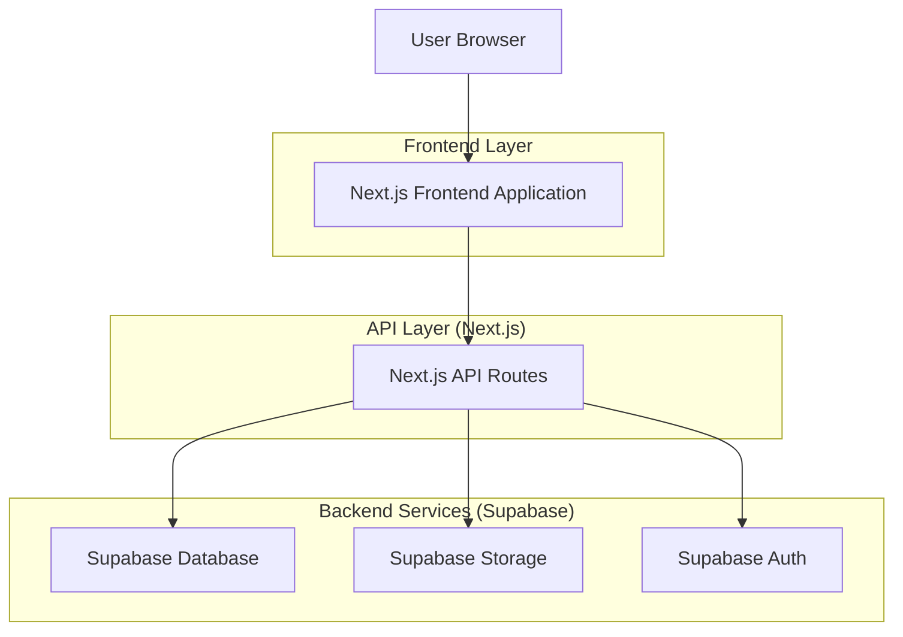
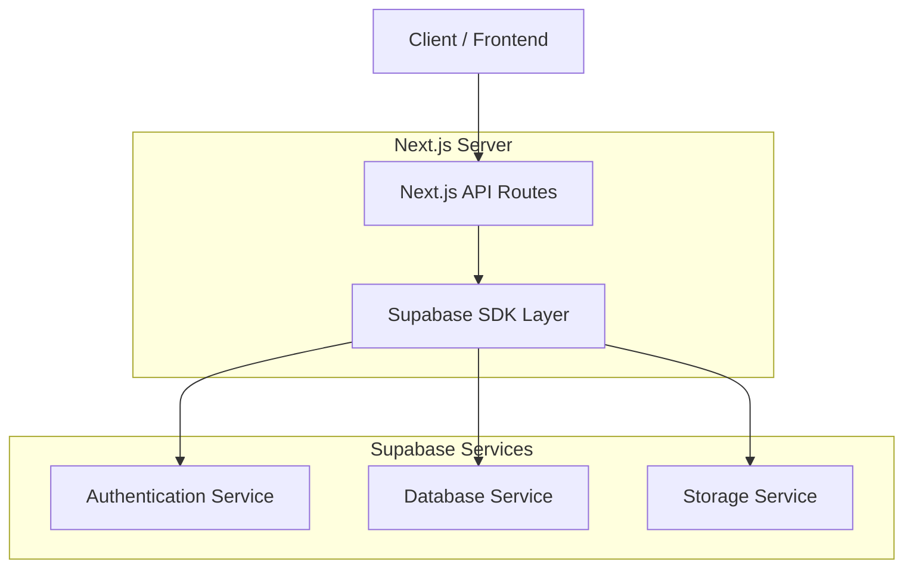
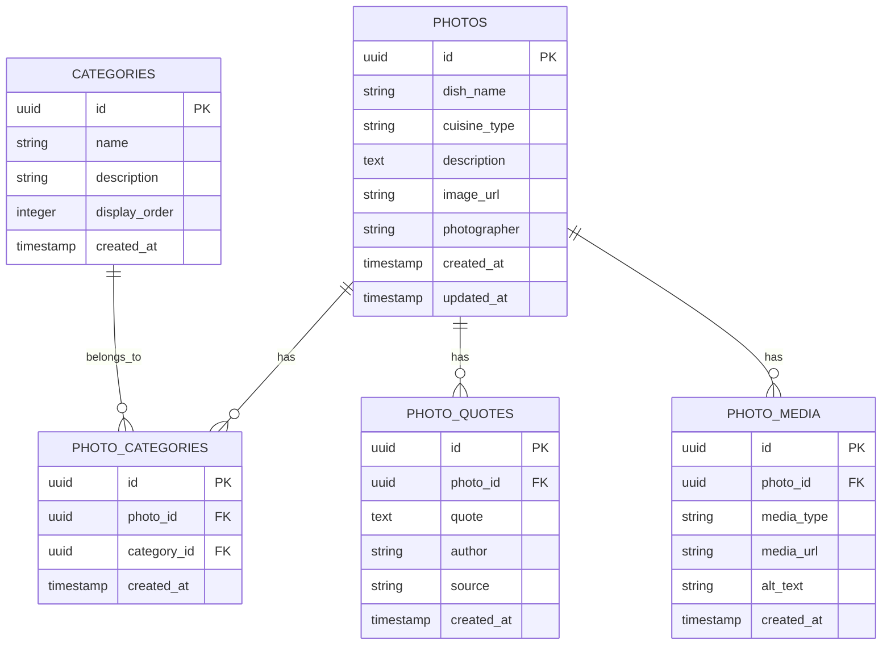

# Technical Architecture Document - Lumiere Culinary Portfolio

## 1.Architecture design



## 2. Technology Description

* Frontend: Next.js\@14 + React\@18 + TypeScript + Tailwind CSS\@3 + Framer Motion

* Backend: Next.js API Routes + Supabase SDK

* Database: Supabase (PostgreSQL)

* Authentication: Supabase Auth

* File Storage: Supabase Storage

* API Documentation: Swagger UI + OpenAPI 3.0

* Deployment: Vercel (Serverless)

## 3. Route Definitions

| Route             | Purpose                                                      |
| ----------------- | ------------------------------------------------------------ |
| /                 | Home page, displays full-screen food photos with drag-scroll |
| /work             | Work page, displays food photography portfolio with filters  |
| /about            | About page, displays photographer/chef information and team  |
| /admin            | Admin login page                                             |
| /admin/dashboard  | Admin dashboard with overview statistics                     |
| /admin/photos     | Food photo management interface                              |
| /admin/categories | Food category management interface                           |
| /admin/media      | Media library management                                     |
| /api-docs         | Swagger API documentation interface                          |

## 4. API Definitions

### 4.1 Core API

**Food Photo Management**

```
GET /api/photos
```

Request:

| Param Name | Param Type | isRequired | Description                |
| ---------- | ---------- | ---------- | -------------------------- |
| category   | string     | false      | Filter by food category    |
| cuisine    | string     | false      | Filter by cuisine type     |
| limit      | number     | false      | Number of photos to return |

Response:

| Param Name | Param Type | Description            |
| ---------- | ---------- | ---------------------- |
| success    | boolean    | Request status         |
| data       | Photo\[]   | Array of photo objects |

```
POST /api/photos
```

Request:

| Param Name    | Param Type | isRequired | Description       |
| ------------- | ---------- | ---------- | ----------------- |
| dish\_name    | string     | true       | Name of the dish  |
| category      | string     | true       | Food category     |
| cuisine\_type | string     | false      | Type of cuisine   |
| description   | string     | false      | Photo description |
| image\_url    | string     | true       | URL of the photo  |

Response:

| Param Name | Param Type | Description          |
| ---------- | ---------- | -------------------- |
| success    | boolean    | Request status       |
| data       | Photo      | Created photo object |

**Awards Management**

```
GET /api/awards
POST /api/awards
PUT /api/awards/[id]
DELETE /api/awards/[id]
```

**Authentication**

```
POST /api/auth/login
```

Request:

| Param Name | Param Type | isRequired | Description    |
| ---------- | ---------- | ---------- | -------------- |
| email      | string     | true       | Admin email    |
| password   | string     | true       | Admin password |

**Media Upload**

```
POST /api/media/upload
```

Request: FormData with file
Response:

| Param Name | Param Type | Description          |
| ---------- | ---------- | -------------------- |
| url        | string     | Uploaded file URL    |
| path       | string     | File path in storage |

**API Documentation**

```
GET /api-docs
```

Swagger UI interface untuk dokumentasi API lengkap dengan interactive testing

```
GET /api/swagger.json
```

OpenAPI 3.0 specification dalam format JSON

## 5. Server Architecture Diagram



## 6. Data Model

### 6.1 Data Model Definition



### 6.2 Data Definition Language

**Photos Table (photos)**

```sql
-- Create table
CREATE TABLE photos (
    id UUID PRIMARY KEY DEFAULT gen_random_uuid(),
    dish_name VARCHAR(255) NOT NULL,
    cuisine_type VARCHAR(100),
    description TEXT,
    image_url VARCHAR(500) NOT NULL,
    photographer VARCHAR(255),
    slug VARCHAR(255) UNIQUE,
    created_at TIMESTAMP WITH TIME ZONE DEFAULT NOW(),
    updated_at TIMESTAMP WITH TIME ZONE DEFAULT NOW()
);

-- Create indexes
CREATE INDEX idx_photos_cuisine_type ON photos(cuisine_type);
CREATE INDEX idx_photos_photographer ON photos(photographer);
CREATE INDEX idx_photos_created_at ON photos(created_at DESC);

-- Grant permissions
GRANT SELECT ON photos TO anon;
GRANT ALL PRIVILEGES ON photos TO authenticated;
```

**Categories Table (categories)**

```sql
-- Create table
CREATE TABLE categories (
    id UUID PRIMARY KEY DEFAULT gen_random_uuid(),
    name VARCHAR(100) NOT NULL UNIQUE,
    description TEXT,
    display_order INTEGER DEFAULT 0,
    created_at TIMESTAMP WITH TIME ZONE DEFAULT NOW()
);

-- Create indexes
CREATE INDEX idx_categories_display_order ON categories(display_order);
CREATE INDEX idx_categories_name ON categories(name);

-- Grant permissions
GRANT SELECT ON categories TO anon;
GRANT ALL PRIVILEGES ON categories TO authenticated;
```

**Film Awards Junction Table**

```sql
-- Create film_awards junction table
CREATE TABLE film_awards (
    id UUID PRIMARY KEY DEFAULT gen_random_uuid(),
    film_id UUID REFERENCES films(id) ON DELETE CASCADE,
    award_id UUID REFERENCES awards(id) ON DELETE CASCADE,
    created_at TIMESTAMP WITH TIME ZONE DEFAULT NOW(),
    UNIQUE(film_id, award_id)
);

-- Create index
CREATE INDEX idx_film_awards_film_id ON film_awards(film_id);
CREATE INDEX idx_film_awards_award_id ON film_awards(award_id);

-- Row Level Security
ALTER TABLE film_awards ENABLE ROW LEVEL SECURITY;
GRANT SELECT ON film_awards TO anon;
GRANT ALL PRIVILEGES ON film_awards TO authenticated;
```

**Film Quotes Table**

```sql
-- Create film_quotes table
CREATE TABLE film_quotes (
    id UUID PRIMARY KEY DEFAULT gen_random_uuid(),
    film_id UUID REFERENCES films(id) ON DELETE CASCADE,
    quote TEXT NOT NULL,
    source VARCHAR(255) NOT NULL,
    created_at TIMESTAMP WITH TIME ZONE DEFAULT NOW()
);

-- Create index
CREATE INDEX idx_film_quotes_film_id ON film_quotes(film_id);

-- Row Level Security
ALTER TABLE film_quotes ENABLE ROW LEVEL SECURITY;
GRANT SELECT ON film_quotes TO anon;
GRANT ALL PRIVILEGES ON film_quotes TO authenticated;
```

**Film Media Table**

```sql
-- Create film_media table
CREATE TABLE film_media (
    id UUID PRIMARY KEY DEFAULT gen_random_uuid(),
    film_id UUID REFERENCES films(id) ON DELETE CASCADE,
    media_url TEXT NOT NULL,
    media_type VARCHAR(50) NOT NULL CHECK (media_type IN ('image', 'video')),
    caption TEXT,
    created_at TIMESTAMP WITH TIME ZONE DEFAULT NOW()
);

-- Create index
CREATE INDEX idx_film_media_film_id ON film_media(film_id);
CREATE INDEX idx_film_media_type ON film_media(media_type);

-- Row Level Security
ALTER TABLE film_media ENABLE ROW LEVEL SECURITY;
GRANT SELECT ON film_media TO anon;
GRANT ALL PRIVILEGES ON film_media TO authenticated;
```

**Initial Data**

```sql
-- Insert sample films
INSERT INTO films (title, director, year, category, description, slug) VALUES
('Savoy', 'Zohar Wagner', 2022, 'Documentary', 'Fast-paced and engrossing documentary', 'savoy'),
('Moon in the 12th House', 'Dorit Hakim Kramer', 2014, 'Feature Film', 'Pure cinematic beauty with breathtaking cinematography', 'moon-in-the-12th-house'),
('Taboo', 'Shauly Melamed', 2024, 'Documentary', 'Groundbreaking LGBTQ+ cinema confronting cultural taboos', 'taboo');

-- Insert sample awards
INSERT INTO awards (name, festival, year, category) VALUES
('Best Director & Editing Award', 'Weizman National Museum', 2022, 'Documentary'),
('Jerusalem Film Festival', 'Jerusalem Film Festival', 2014, 'Feature Film'),
('World Premiere', 'POV Magazine', 2024, 'Documentary');
```

